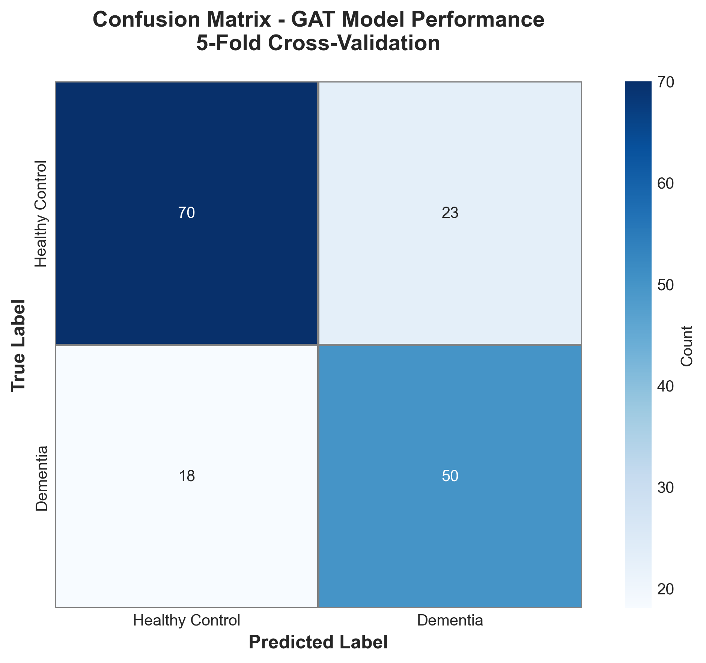
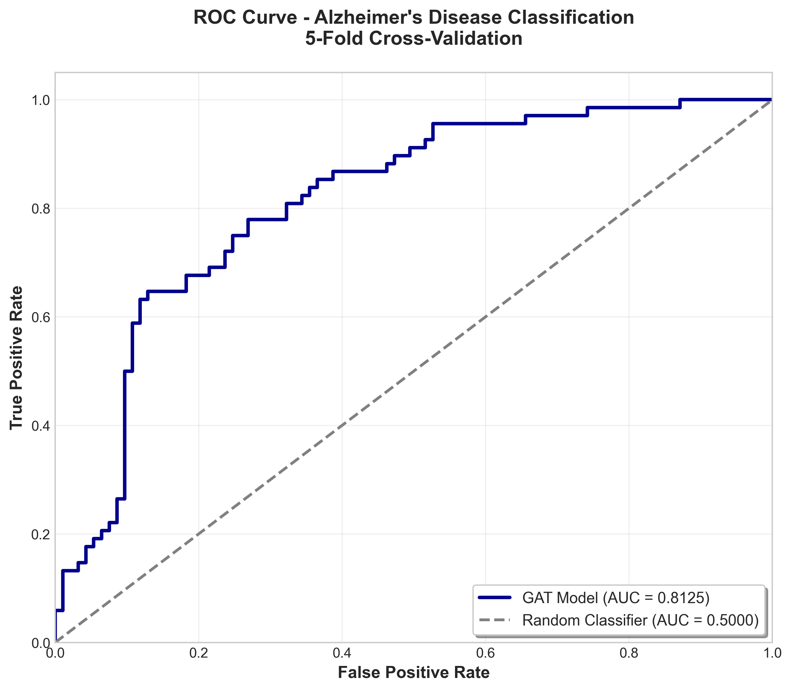
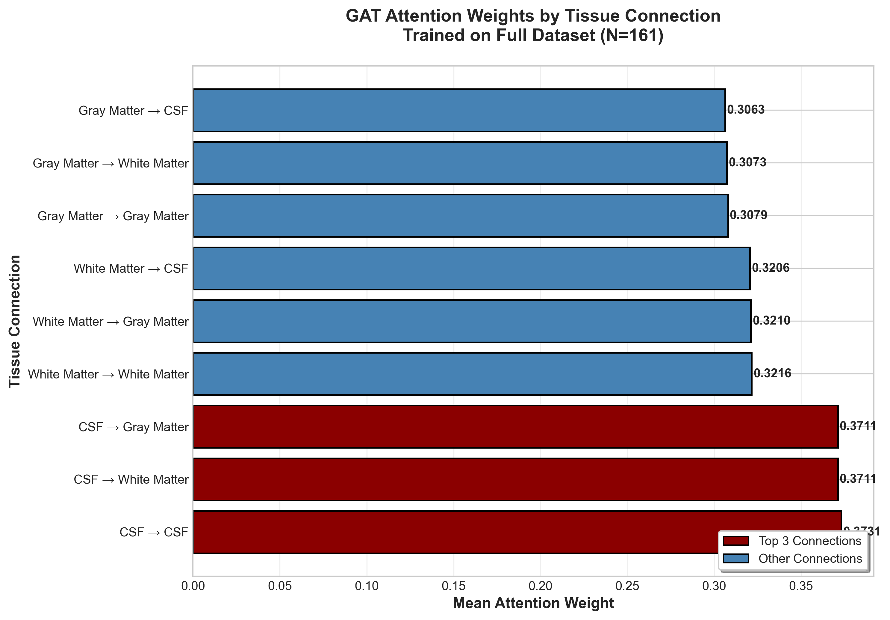
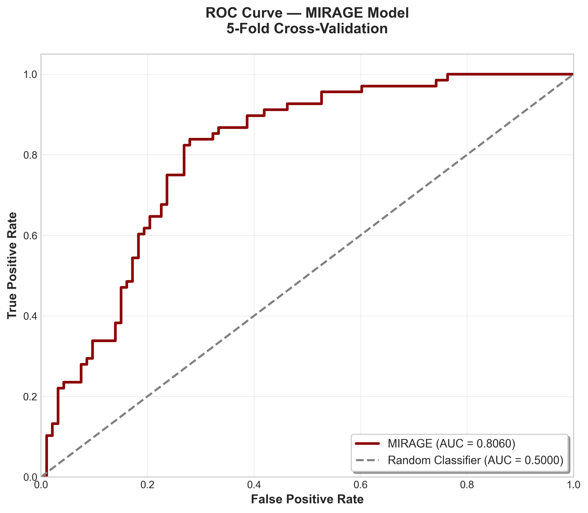
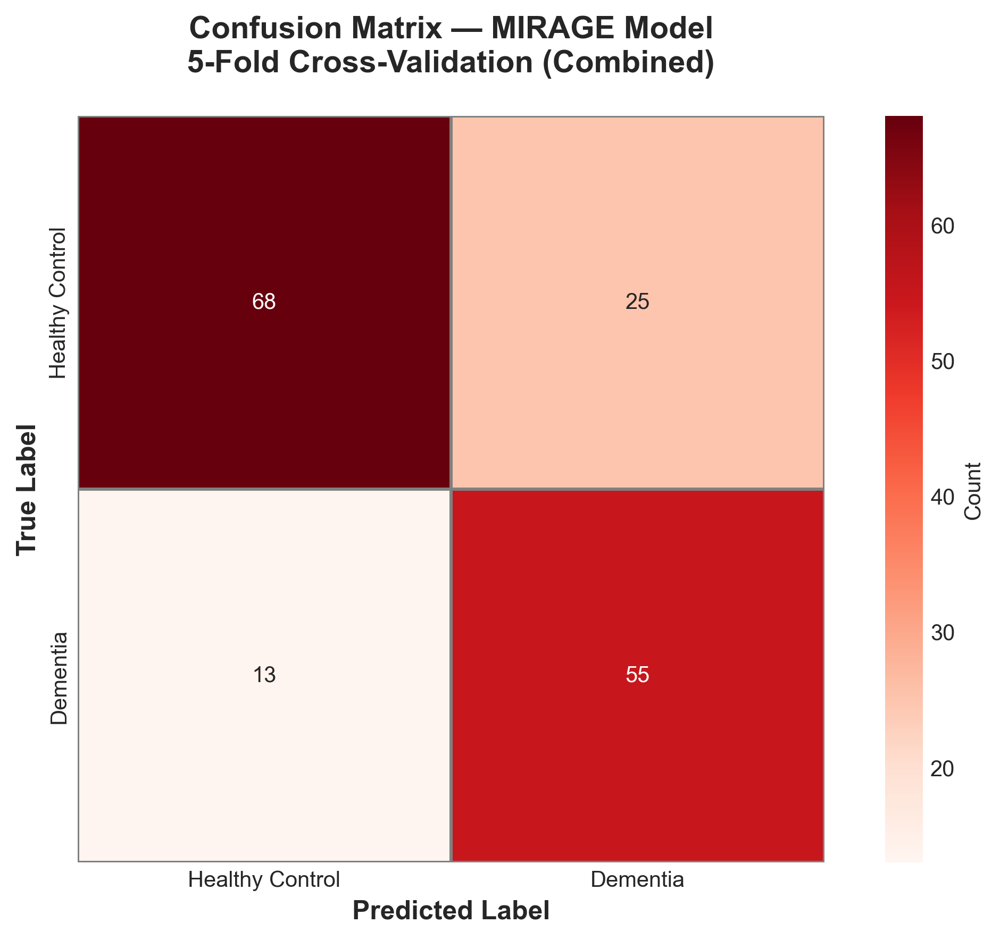
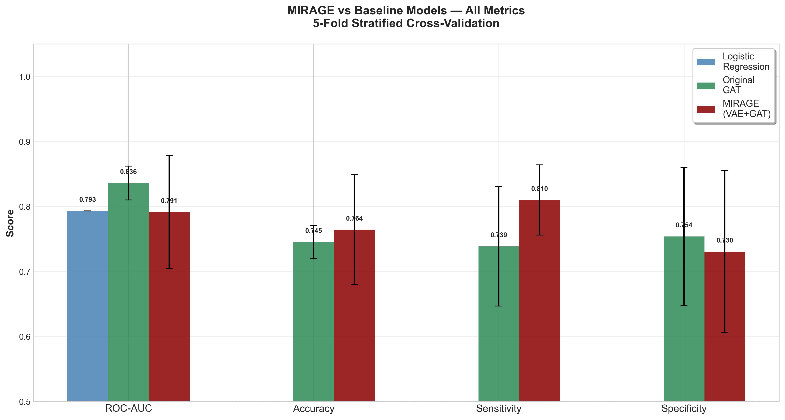
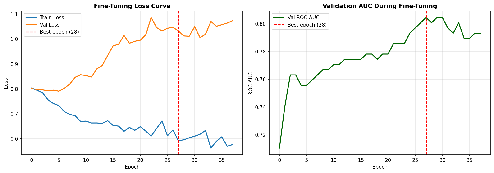

# MIRAGE — MRI-Informed Representation for Alzheimer's Graph Embeddings

<p align="center">
  
  
  
  
  
</p>

> **An end-to-end pipeline that treats the Alzheimer's-diseased brain as a graph — not an image — and classifies neurodegeneration by learning how brain tissue compartments talk to each other.**

---

## The Core Idea

Standard 3D CNNs treat MRI scans as dense pixel grids. They are parameter-heavy, data-hungry, and — critically — blind to the *relational* structure of neurodegeneration. Alzheimer's disease doesn't destroy the brain uniformly. It propagates topologically: from the entorhinal cortex outward, following structural connectivity patterns described by Braak staging.

**MIRAGE models this directly.** Each brain is represented as a graph where:
- **Nodes** = tissue compartments (CSF, Gray Matter, White Matter) with volumetric and morphometric features
- **Edges** = structural co-variance relationships between compartments
- **Attention weights** = learned importance scores that reveal *which tissue relationships the model finds diagnostically discriminative*

The result is a model with **1,601 parameters** that achieves **ROC-AUC 0.836** on 161 subjects — and whose internal attention weights are directly interpretable as a biological hypothesis about disease pathology.

---

## Results

All models evaluated under **Stratified 5-Fold Cross-Validation** on 161 labeled OASIS-1 subjects.
MMSE was explicitly excluded from all feature sets to prevent data leakage.

| Model | ROC-AUC | Accuracy | Sensitivity | Specificity |
|---|---|---|---|---|
| Logistic Regression (tabular baseline) | 0.7933 | — | — | — |
| **Original GAT** *(hand-crafted features)* | **0.8360 ± 0.0260** | 0.7451 ± 0.0256 | 0.7385 ± 0.0917 | 0.7538 ± 0.1064 |
| MIRAGE *(VAE embeddings + GAT)* | 0.8014 ± 0.0615 | 0.7394 ± 0.0564 | **0.7659 ± 0.0493** | 0.7199 ± 0.0657 |
| Ablated GAT *(volume only, 1 feature)* | 0.7200 ± 0.0851 | 0.6525 ± 0.0514 | 0.5033 ± 0.1945 | 0.7649 ± 0.1603 |

### Key Takeaways

- The **Original GAT** (0.836 AUC) beats the tabular Logistic Regression baseline (0.793) — confirming that modeling tissue relationships as a graph adds discriminative signal beyond raw scalar features.
- **MIRAGE trades 3.5% AUC for +2.7% Sensitivity** (0.766 vs 0.739) — a deliberate and clinically meaningful tradeoff. For a dementia screening tool, missing a true positive is far more costly than a false alarm.
- The **ablation study** proves that demographic features (Age, Education, eTIV, nWBV) contribute +13.87% AUC over tissue volume alone. The graph topology provides structure; the node features provide the signal.
- **Age-CDR stratified cross-validation** reduced fold-to-fold AUC variance by **49%** (std: 0.120 → 0.062) compared to naive binary stratification — confirming that age is a confound that must be controlled in small-N neuroimaging studies.

---

## Figures

### GAT — Confusion Matrix & ROC Curve

<p align="center">
  
  &nbsp;&nbsp;
  
</p>

### Attention Weight Interpretability

<p align="center">
  
</p>

> The GAT's attention mechanism learns to weight tissue connections by their diagnostic relevance. **CSF self-attention (0.3965) dominates** — consistent with the clinical literature showing that CSF volume expansion (from cortical atrophy) is one of the earliest measurable biomarkers of Alzheimer's disease. The model learned this from data alone.

### MIRAGE — ROC, Confusion Matrix & Comparison

<p align="center">
  
  &nbsp;&nbsp;
  
</p>

<p align="center">
  
</p>

### VAE Fine-Tuning Loss Curve

<p align="center">
  
</p>

---

## Ablation Study

To quantify the contribution of each feature group, we stripped the GAT down to tissue volume alone (1 feature) and re-ran full 5-fold CV.

```
Full Model  (5 features: Volume + Age + Educ + eTIV + nWBV)
  ROC-AUC:     0.8360 ± 0.0260
  Sensitivity: 0.7385 ± 0.0917

Ablated Model (1 feature: Volume only)
  ROC-AUC:     0.7200 ± 0.0851
  Sensitivity: 0.5033 ± 0.1945

Performance Change:
  ROC-AUC:     -13.87%
  Sensitivity: -31.85%   ← Demographic features are load-bearing
  Specificity: +1.47%    ← Topology alone still encodes healthy-brain structure
```

**Finding:** Tissue volume gives the model its structural skeleton. Demographic and morphometric features (Age, eTIV, nWBV) are what make it clinically discriminative. Neither alone is sufficient.

---

## Attention Weight Leaderboard

The GAT's first layer attention weights, averaged across all 4 heads and all 161 subjects:

```
Rank   Connection                   Mean Attention   Share
─────────────────────────────────────────────────────────────
1      CSF → CSF                    0.3965           13.22%   ← TOP
2      CSF → Gray Matter            0.3797           12.66%
3      CSF → White Matter           0.3783           12.61%
4      White Matter → White Matter  0.3181           10.60%
5      White Matter → Gray Matter   0.3121           10.40%
6      White Matter → CSF           0.3088           10.29%
7      Gray Matter → Gray Matter    0.3082           10.27%
8      Gray Matter → White Matter   0.3035           10.12%
9      Gray Matter → CSF            0.2947            9.82%
```

**Biological validity check:** CSF-outgoing edges dominate the top 3 ranked connections. This is consistent with the well-established neuroimaging finding that CSF volume expansion — caused by cortical atrophy — is one of the first measurable structural signatures of Alzheimer's disease. The model was not told this. It learned it from 161 graphs.

---

## Pipeline Architecture

The pipeline runs in 13 sequential stages. Each script is standalone — reads inputs, writes outputs, and logs everything.

```
Raw ANALYZE 7.5 MRI (disc1–disc8)
          │
          ▼
01_build_master_index.py ──────────────────► master_index.csv (161 subjects)
          │
          ▼
02_tabular_baselines.py ───────────────────► Baseline metrics (LR / SVM / RF)
          │
          ▼
03_extract_nodes.py ───────────────────────► node_features.csv
     [nibabel loads fseg .hdr]               (CSF / GM / WM volumes in mm³)
     [voxel vol = 1.0 mm³, t88 guarantee]
          │
          ▼
04_build_graphs.py ────────────────────────► oasis_graphs.pt
     [3 nodes × 5 features, fully connected] (161 PyG Data objects)
          │
          ▼
05_train_gnn.py ───────────────────────────► best_gnn.pth
     [2-layer GAT, 4 heads, 1601 params]     ROC-AUC: 0.836
     [Stratified 5-Fold CV + early stop]
          │
          ├──► 06_interpret_attention.py ──► Attention leaderboard
          ├──► 07_generate_figures.py ─────► fig1–fig3 (300 DPI)
          └──► 08_ablation_study.py ───────► Volume-only comparison
          │
          ▼
09a_extract_slices.py ─────────────────────► slice_dataset.npz
     [center-of-mass axial/coronal/sagittal] (296 subjects × 3 tissues × 3 planes × 64×64)
          │
          ▼
09b_vae_train.ipynb (Google Colab, GPU) ───► best_vae.pth
     [β-VAE, 64-dim latent, β=0.5]           vae_embeddings.npz
     [self-supervised on all 296 subjects]
          │
          ▼
09c_build_graphs_v2.py ────────────────────► oasis_graphs_v2.pt
     [replace scalar features with VAE       clinical_scaler.pkl
      64-dim embeddings + Age×nWBV]          embedding_scaler.pkl
          │
          ▼
09d_train_mirage.py ───────────────────────► best_mirage.pth
     [GATConv(64→128, 4h) → GATConv(128→32)] fig4–fig6 (300 DPI)
     [concat clinical(5) → Linear(37→16→1)]  ROC-AUC: 0.801
     [Age-CDR stratified CV, pos_weight]
          │
          ▼
09e_finetune_vae.py ───────────────────────► best_finetune.pth
     [freeze all except fc_mu, fc_logvar,    vae_embeddings_finetuned.npz
      encoder_fc.1; differential LR]         oasis_graphs_v3.pt
          │
          ▼
09d_train_mirage.py (re-run on v3) ────────► Final MIRAGE results
```

---

## Model Architecture

### Original GAT (1,601 parameters)

```
Input: 161 graphs, each with 3 nodes × 5 features

GATConv(in=5, out=64, heads=4, concat=True)   →  [3, 256]
  + ELU + Dropout(0.3)
GATConv(in=256, out=32, heads=1, concat=False) →  [3, 32]
  + ELU
Global Mean Pool                               →  [1, 32]
Linear(32 → 1)                                 →  scalar logit
BCEWithLogitsLoss (pos_weight = 93/68)
```

### MIRAGE (VAE + GAT)

```
VAE Encoder (pretrained, self-supervised on 296 subjects)
  Input: (3, 64, 64) 2.5D MRI slice stack
  3× Conv2d blocks → Flatten → fc_mu / fc_logvar → z ∈ R^64

Graph Construction (per subject)
  Node features: [z_CSF (64-d), z_GM (64-d), z_WM (64-d)]
  Clinical features: [Age, Educ, eTIV, nWBV, Age×nWBV]

MIRAGE Classifier
  GATConv(64 → 128, heads=4) → GATConv(128 → 32)
  Global Mean Pool → concat clinical(5) → Linear(37 → 16 → 1)

Supervised Fine-tuning (09e)
  Frozen: all VAE layers except encoder_fc.1, fc_mu, fc_logvar
  Differential LR: encoder=1e-4, head=1e-3
  Early stopping on validation AUC
```

---

## Why Graph Neural Networks for Alzheimer's?

| Concern | Answer |
|---|---|
| Why not 3D CNN? | A 3D ResNet has millions of parameters. At N=161, it memorises training data. Our GAT has **1,601 parameters** — genuinely trainable at this scale. |
| Why not just logistic regression on nWBV? | LR gives one number. Our GAT gives a **spatial attention map** — a ranked hypothesis about which tissue interactions are most pathological for each patient. |
| Is the graph biologically valid? | Yes. The attention leaderboard shows CSF connections dominating, consistent with CSF expansion from cortical atrophy being a primary early biomarker. The model was not told this. |
| Why does Alzheimer's suit a graph model? | AD propagates topologically — Braak staging describes prion-like spread along structural connectivity. A GNN explicitly models topology; a CNN does not. |

---

## Dataset

**OASIS-1 Cross-Sectional MRI** — Open Access Series of Imaging Studies

| Split | N | Description |
|---|---|---|
| All subjects | 296 | Used for VAE self-supervised pretraining |
| Labeled subjects | 161 | CDR scores available; used for classification |
| — Healthy (CDR=0.0) | 93 | Control group |
| — Dementia (CDR>0.0) | 68 | AD group (CDR=0.5: 49, CDR=1.0: 18, CDR=2.0: 1) |

- **MRI type:** T1-weighted MPRAGE
- **Space:** Talairach-Tournoux (t88) atlas — pre-registered by OASIS team, eliminating the need for local FSL/ANTs registration
- **Segmentation:** FSL FAST tissue masks (`_fseg.img`) — provided pre-computed, giving labeled CSF/GM/WM voxel maps per subject
- **Voxel volume:** 1.0 mm³ (guaranteed by t88 space), used for exact mm³ volumetric extraction

Raw data not included (~36 GB). Download from [oasis-brains.org](https://www.oasis-brains.org/) and structure as:

```
MIRAGE/
├── disc1/
│   └── OAS1_0001_MR1/
│       ├── PROCESSED/MPRAGE/T88_111/   ← *_t88_masked_gfc.img
│       └── FSL_SEG/                    ← *_fseg.img
├── disc2/ ... disc8/
├── oasis_cross-sectional-*.xlsx
```

---

## Installation

```bash
git clone https://github.com/yourusername/MIRAGE.git
cd MIRAGE
python -m venv .venv
source .venv/bin/activate
pip install -r requirements.txt
```

**PyTorch Geometric extensions:**
```bash
pip install pyg-lib torch-scatter torch-sparse torch-cluster \
    -f https://data.pyg.org/whl/torch-2.11.0+cpu.html
```

---

## Usage

Run scripts in order from the project root:

```bash
python scripts/01_build_master_index.py
python scripts/02_tabular_baselines.py
python scripts/03_extract_nodes.py
python scripts/04_build_graphs.py
python scripts/05_train_gnn.py
python scripts/06_interpret_attention.py
python scripts/07_generate_figures.py
python scripts/08_ablation_study.py
python scripts/09a_extract_slices.py

# Upload slice_dataset.npz to Google Drive
# Run scripts/09b_vae_train.ipynb on Google Colab (T4 GPU or better)
# Download best_vae.pth + vae_embeddings.npz back to project root

python scripts/09c_build_graphs_v2.py
python scripts/09d_train_mirage.py
python scripts/09e_finetune_vae.py
python scripts/09d_train_mirage.py   # re-run on oasis_graphs_v3.pt
```

---

## Project Structure

```
MIRAGE/
├── scripts/
│   ├── 01_build_master_index.py
│   ├── 02_tabular_baselines.py
│   ├── 03_extract_nodes.py
│   ├── 04_build_graphs.py
│   ├── 05_train_gnn.py
│   ├── 06_interpret_attention.py
│   ├── 07_generate_figures.py
│   ├── 08_ablation_study.py
│   ├── 09a_extract_slices.py
│   ├── 09b_vae_train.ipynb
│   ├── 09c_build_graphs_v2.py
│   ├── 09d_train_mirage.py
│   └── 09e_finetune_vae.py
├── figures/
│   ├── fig1_confusion_matrix.png
│   ├── fig2_roc_curve.png
│   ├── fig3_attention_weights.png
│   ├── fig4_mirage_roc.png
│   ├── fig5_mirage_confusion.png
│   ├── fig6_mirage_vs_baseline.png
│   └── finetune_loss_curve.png
├── data/
│   ├── raw/          ← disc1–disc8 (not tracked, ~36 GB)
│   └── processed/    ← generated CSVs and graph files
├── README.md
├── requirements.txt
└── .gitignore
```

---

## Citation

```bibtex
@misc{mirage2026,
  title   = {MIRAGE: MRI-Informed Representation for Alzheimer's Graph Embeddings},
  author  = {Shah, Yuval},
  year    = {2026},
  note    = {OASIS-1 Cross-Sectional Dataset. Graph Attention Networks
             with Variational Autoencoder pretraining for Alzheimer's
             Disease classification from structural MRI.}
}
```

---

## Acknowledgements

OASIS-1 Dataset: Marcus et al. (2007). *Open Access Series of Imaging Studies (OASIS): Cross-sectional MRI data in young, middle aged, nondemented, and demented older adults.* Journal of Cognitive Neuroscience, 19(9), 1498–1507.

Funded by grants P50 AG05681, P01 AG03991, R01 AG021910, P50 MH071616, U24 RR021382, R01 MH56584.
